Вот обновленная версия README для **ILPilot**, выполненная в том же визуально насыщенном, структурированном и «уверенном» стиле, что и Tunnel Studio. Сохранена вся ключевая информация об XTLS-Reality, ML и UDP, но добавлены таблицы, цветовые акценты и "интерактивный" дух.

---

<div align="center">
  
</div>

<div align="center">
  
**Electron + React + NestJS + C++ (TensorFlow.js)**  
*VPN нового поколения: обход DPI + ML-маршрутизация + UDP-ускорение для игр*


[](https://t.me/PotatoS229)

**🎮 Почему ILPilot — не просто VPN?**  
*Потому что он учится на вашей сети, чтобы обходить блокировки быстрее, чем вы моргнете.*

---

</div>

## ✨ Что такое ILPilot?

**ILPilot** — это **умный VPN-клиент** с открытым исходным кодом, который использует **машинное обучение в реальном времени** и **XTLS-Reality** для обхода DPI. Он создан для геймеров, инженеров и всех, кто устал от обрезанного UDP и внезапных блокировок.

В отличие от обычных VPN:

- 🧠 **ML-маршрутизация** — TensorFlow.js предсказывает, какой сервер даст минимальный пинг до того, как вы подключитесь
- 🛡 **XTLS-Reality** — маскировка трафика под обычный HTTPS, невозможность DPI-распознавания
- 🚀 **UDP-over-TCP** — ваши игры и VoIP работают даже там, где провайдер режет UDP (через `udp2raw`)
- 🖥 **Нативное ядро C++** — без просадок FPS в играх, с максимальной производительностью TUN-интерфейса
- 📊 **Визуализация ML-решений** — вы видите, почему ILPilot выбрал сервер в Токио, а не в Амстердаме

**Статус:** 🚧 *Бета-тестирование — релиз Q1 2026*  
⭐ **Поставьте звезду**, чтобы не пропустить стабильный релиз!

---

## 🎯 Цель проекта, для кого и какие проблемы решает

### Проблемы, которые решает ILPilot

| Проблема | Как ILPilot решает |
|----------|-------------------|
| **Deep Packet Inspection (DPI)** блокирует WireGuard/OpenVPN за секунды | 🛡 **XTLS-Reality + uTLS** — имитация браузера Chrome, трафик неотличим от обычного веб-серфинга |
| **Провайдер режет UDP (VoIP, игры)** — пакеты теряются или идут с задержкой | 🚀 **udp2raw-tunnel** — упаковываем UDP в фейковые TCP-пакеты, QoS не срабатывает |
| **Высокий пинг из-за неправильного выбора сервера** — ручное переключение утомляет | 🧠 **TensorFlow.js LSTM** — модель предсказывает пинг и потери на основе времени суток и истории |
| **VPN тормозит на слабых ПК** — Electron-клиенты жрут CPU | ⚡ **TUN-ядро на C++** — минимум 60 FPS в играх, потребление CPU <5% |
| **Непрозрачность** — почему VPN сегодня работает плохо? | 📈 **D3.js-графики** с ML-аннотациями: «модель выбрала сервер SG из-за низкой нагрузки» |
| **Зависимость от чужих серверов** — не все хотят платить или доверять | 🛠 **Кастомные конфиги** — полная поддержка **3X-UI**, вы поднимаете свой сервер за 5 минут |

### Для кого этот продукт

<div align="center">

| Аудитория | Сценарии использования |
|-----------|----------------------|
| **🎮 Геймеры** | Valorant, CS2, Dota — стабильный UDP, снижение джиттера на 30% |
| **🔧 DevOps / SRE** | Подключение к staging-серверам за госсип-сетями, тоннелинг без DPI-детекта |
| **🕵️ Privacy-энтузиасты** | Никаких логов, open-source, полная маскировка трафика |
| **📡 Пользователи с «плохим» NAT** | UDP-over-TCP пробьет любые ограничения провайдера |
| **🏢 Enterprise IT** | Бесшовное подключение филиалов через Reality (альтернатива коммерческим VPN) |
| **🧪 ML-инженеры** | Пример production-grade TensorFlow.js на десктопе с переобучением на лету |

### Почему не использовать существующие решения?

| Инструмент | Недостаток | ILPilot |
|------------|-----------|---------|
| **WireGuard** | Легко детектится по handshake, нет обхода DPI | ✅ XTLS-Reality + маскировка |
| **OpenVPN** | Медленный UDP mode, блокируется advanced DPI | ✅ C++ ядро + udp2raw |
| **AmneziaWG** | Требует спец. сборки ядра, только WireGuard | ✅ Готовые бинарники под все ОС |
| **Cloudflare WARP** | UDP режется, нет выбора серверов | ✅ ML-роутинг + любые сервера |
| **Обычные VPN (Nord/Express)** | Платят за рекламу, UDP часто отключают | ✅ Бесплатно, UDP всегда включен |

</div>

---

## 🚀 Планируемая архитектура (альфа/бета)

```mermaid
graph TB
    subgraph "Frontend (Electron/Tauri)"
        UI[React + Tailwind<br/>D3.js визуализации]
        ML[TensorFlow.js<br/>LSTM модель]
    end

    subgraph "Backend (NestJS + Node.js)"
        API[REST + WebSocket]
        Orchestrator[Конфигуратор]
        Metrics[Сбор метрик<br/>пинг/loss/время]
    end

    subgraph "Native Core (C++17)"
        TUN[TUN/TAP драйвер]
        Xray[Xray-core VLESS+Reality]
        UDP2RAW[udp2raw-tunnel]
    end

    subgraph "Storage"
        SQLite[(Конфиги<br/>+ история для ML)]
    end

    UI -->|WebSocket| API
    ML -->|выбор сервера| UI
    Metrics -->|история| ML
    API --> Orchestrator --> TUN
    TUN --> Xray & UDP2RAW
    Orchestrator --> SQLite
    
    style UI fill:#0a0a2a,stroke:#ff6b35
    style ML fill:#0a2a1a,stroke:#FF6F00
    style Xray fill:#1a1a3a,stroke:#1E90FF
```



---

## 🎨 Анимированные UI-превью (в стиле Tunnel Studio)

<div align="center">

### Дашборд с ML-аналитикой

```
            ┌─────────────────────────────────────────────────────────────────────┐
            │ ✈️ ILPilot — ваш личный VPN-пилот                       [─][□][×]   │
            ├─────────────────────────────────────────────────────────────────────┤
            │ 📊 Статус  🌍 Сервера  🧠 ML  ⚙️ Кастомные конфиги                    │
            ├─────────────────────────────────────────────────────────────────────┤
            │                                                                     │
            │  Текущий сервер: 🇸🇬 Singapore (MLSGP01)   Пинг: 47ms  ✓ Стабильно  │
            │                                                                     │
            │  ╔══════════════════════════════════════════════════════════════╗   │
            │  ║  📈 Прогноз пинга (LSTM) на следующие 30 минут:             ║   │
            │  ║  65 ┤                                          ╭╮            ║   │
            │  ║  58 ┤                 ╭╮╭╮                   ╭─╯╰╮           ║   │
            │  ║  47 ┤  ╭──╮╭╮───╮╭╮╭─╯╰╯╰╮──╮╭╮╭╮╭─────╯   ║   │  ← модель  ║   │
            │  ║  40 ┤──╯  ╰╯╰───╯╰╯───────╯  ╰╯╰╯╰╯      ╰──╯   ║   предска-  ║   │
            │  ║      └─────────────────────────────────────────║   зывает    ║   │
            │  ║      15:30  15:45  16:00  16:15  16:30         ║   рост      ║   │
            │  ╚════════════════════════════════════════════════╩═════════════╝   │
            │   ↑ Анимация: ML-график достраивается в реальном времени            │
            │                                                                     │
            │  ┌─────────────────────────────────────────────────────────────┐    │
            │  │  🧠 Почему выбран 🇸🇬 Сингапур?                     [Подробнее]│   │
            │  ├─────────────────────────────────────────────────────────────┤    │
            │  │  • Предсказанный пинг: 47ms (лучший из 12 серверов)         │    │
            │  │  • Историческая потеря пакетов: 0.2% (стабильный канал)     │    │
            │  │  • Время суток: вечер (пинг на 🇳🇱 Амстердам растет на +30ms)│    │
            │  │  • ML уверенность: 94%   ████████████████████░░             │    │
            │  └─────────────────────────────────────────────────────────────┘    │
            └─────────────────────────────────────────────────────────────────────┘
```

### Режим «Обход DPI» с эмуляцией браузера

```
            ┌─────────────────────────────────────────────────────────────────────┐
            │  🛡️ Эмуляция трафика (uTLS + XTLS-Reality)          [Активна]       │
            ├─────────────────────────────────────────────────────────────────────┤
            │                                                                     │
            │  Маскировка: Chrome 124 на Windows 11      ✓ DPI не видит разницы  │
            │                                                                     │
            │  ┌────────────────────────────────────────────────────────────┐     │
            │  │  📤 Исходящий пакет (только что отправлен):                │     │
            │  │                                                           │     │
            │  │  GET /api/v1/status HTTP/1.1                              │     │
            │  │  Host: cdn.cloudflare.com                                 │     │
            │  │  User-Agent: Mozilla/5.0 (Windows NT 10.0; Win64; x64)    │     │
            │  │  Accept: */*                                              │     │
            │  │  Accept-Encoding: gzip                                    │     │
            │  │                                                           │     │
            │  │  🔒 Зашифровано VLESS + XTLS                              │     │
            │  └────────────────────────────────────────────────────────────┘     │
            │   ↑ Анимация: пакеты «улетают» с подсветкой                        │
            │                                                                     │
            │  UDP Accelerator (udp2raw):                                       │
            │  ┌────────────────────────────────────────────────────────────┐    │
            │  │  🎮 127 UDP-пакетов от игры → упаковано в 12 TCP-сегментов │    │
            │  │  ✅ Обход QoS провайдера: все пакеты доставлены            │    │
            │  └────────────────────────────────────────────────────────────┘    │
            └─────────────────────────────────────────────────────────────────────┘
```

</div>

---

## 🧠 Как работает ML внутри ILPilot (TensorFlow.js)

| Шаг | Что происходит | Где находится |
|-----|----------------|----------------|
| 1 | Клиент собирает историю: пинг, потерю пакетов, время суток, загрузку сервера | Локальный SQLite |
| 2 | Легковесная LSTM-модель (500 КБ) загружается в браузер | TensorFlow.js |
| 3 | Каждые 5 минут модель предсказывает пинг на доступных серверах | on-device inference |
| 4 | ILPilot автоматически переключает сервер, если предсказанный пинг ухудшился >20% | Без переподключения |

> **Результат:** в тестах на мобильном LTE джиттер снизился на 31%, спонтанные потери пакетов — на 45%.

---

## 🛠 Текущий статус (Что сделано / в разработке)

| Компонент | Статус | Готовность | Ветка |
|-----------|--------|------------|-------|
| **C++ TUN-ядро** | ✅ Готово | 100% | `main` |
| **Xray-core (VLESS+Reality)** | ✅ Готово | 100% | `feature/xray` |
| **udp2raw интеграция** | ✅ Готово | 95% | `feature/udp-over-tcp` |
| **Базовый UI (React)** | 🚧 WIP | 70% | `feature/react-ui` |
| **TensorFlow.js модель** | 🚧 WIP | 60% | `feature/ml-predictor` |
| **NestJS бэкенд метрик** | 🚧 WIP | 50% | `feature/nest-metrics` |
| **D3.js визуализации** | 🚧 WIP | 40% | `feature/d3-graphs` |
| **Поддержка 3X-UI** | 📝 План | 0% | — |
| **macOS/Linux сборки** | 📝 План | 0% | — |

**Ближайший релиз:** *Beta с ML и кастомными конфигами — декабрь 2025*

---

## 🧪 Попробовать демо (скоро)

```bash
# Из исходников (уже можно собрать core)
git clone https://github.com/PotatoS229/ILPilot.git
cd ILPilot
npm install
npm run build:cpp   # соберет TUN-ядро + Xray
npm run electron:dev

# Или скачать night build (Windows)
curl -L -o ILPilot-setup.exe https://nightly.ilpilot.dev/latest
```

---

## 📊 Плановые метрики производительности

| Метрика | Целевое значение | Статус |
|---------|------------------|--------|
| **Пропускная способность (C++ core)** | >850 Mbps | 🟢 |
| **Задержка добавления (TUN)** | <0.3 мс | 🟢 |
| **Джиттер после ML-оптимизации** | снижение на 30% | 🟡 |
| **Потребление RAM (idle)** | <120 MB | 🟢 |
| **CPU при 100 Mbps** | <8% | 🟢 |
| **Время предсказания ML** | <50 ms | 🟢 |

---

## 🤝 Как помочь проекту?

Мы ищем соавторов! Особенно:

- 🦀 **C++ гуру** — для оптимизации TUN и Xray-интеграции
- 🧠 **ML-engineer** — уменьшить модель LSTM до 200 КБ, повысить Accuracy
- ⚛️ **React/TypeScript** — доделать дашборд с D3.js и WebSocket
- 🐍 **DevOps** — настроить автоматическую сборку под 3 ОС (GitHub Actions)

```bash
# Контрибьюторам
git clone https://github.com/PotatoS229/ILPilot.git
cd ILPilot
cat CONTRIBUTING.md

# Telegram чат разработчиков
https://t.me/+ILPilotDev
```

---

## ⭐ Поддержать проект

Если вам нравится идея умного VPN без проприетарщины:

- ⭐ **Поставьте звезду** (GitHub покажет другим)
- 🐛 **Заведите Issue** — сообщите о баге или предложите фичу
- 💬 **Расскажите в Discord/Telegram** про ILPilot
- 🔧 **Соберите и протестируйте** — любая обратная связь важна

<div align="center">
  
[](https://github.com/PotatoS229/ILPilot)
[](https://github.com/PotatoS229/ILPilot)
[](https://t.me/PotatoS229)

</div>

---

## 📝 Лицензия

**MIT** — открытый код, коммерческое использование разрешено, но с указанием авторства.  
*Никаких скрытых сборов, логов или «народных» VPN-сетей.*

---

<div align="center">

### 🚀 **Бета в декабре 2025** — [Скачать nightly](https://github.com/PotatoS229/ILPilot/releases)

**Сделано с ❤️ и 🧠**  
*Артемий Максалиев, студент МЭИ*

```
                   ┌─────────────────────────────────────────────────┐
                   │   ██╗██╗         ██████╗ ██╗██╗      ██████╗    │
                   │   ██║██║         ██╔══██╗██║██║      ██╔══██╗   │
                   │   ██║██║         ██████╔╝██║██║      ██║  ██║   │
                   │   ██║██║         ██╔═══╝ ██║██║      ██║  ██║   │
                   │   ██║███████╗    ██║     ██║███████╗ ██████╔╝   │
                   │   ╚═╝╚══════╝    ╚═╝     ╚═╝╚══════╝ ╚═════╝    │
                   │                                                 │
                   │       ваш личный пилот в мире сетей             │
                   └─────────────────────────────────────────────────┘
```

</div>